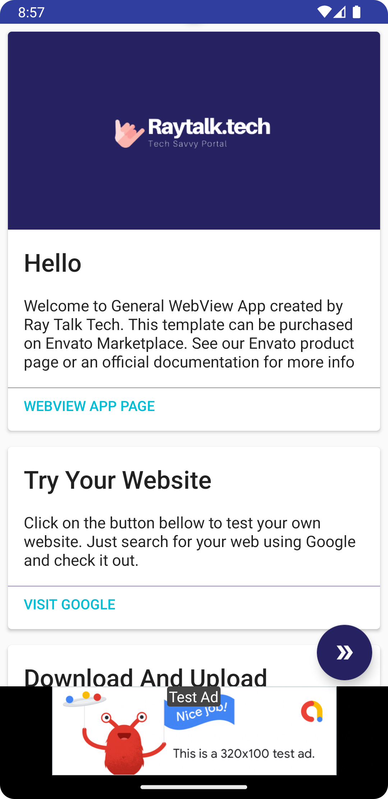
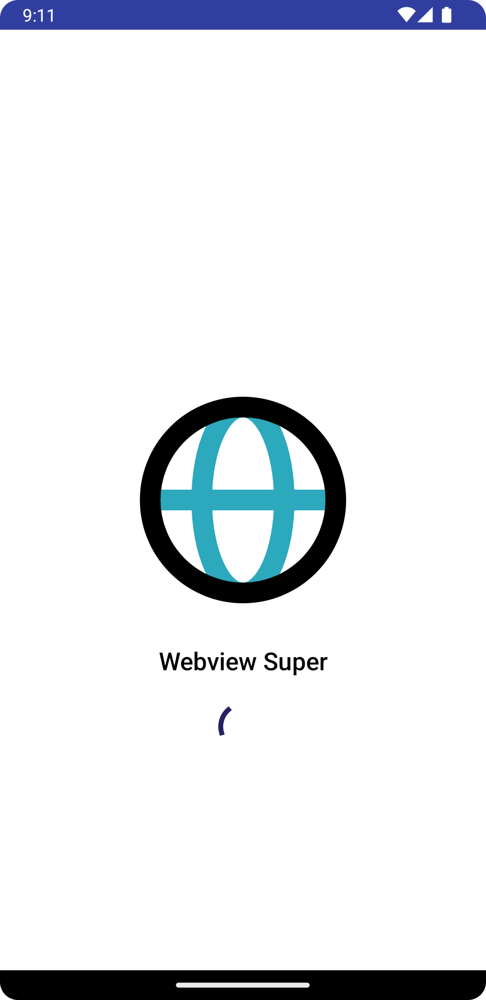

# WebView Super

An Project to use a WebView using JAVA and also can be a template for your App Project.

## Config

- Constant.java : Common Config the app
- config.properties : Admob Key dev & Prod
- google-services.json : Firebase Config

## Version

- v1.0
    - Supported Google Admob Ads
    - Splashscreen
    - Swipe Refresh
    - Floating Action button Settings
    - Handle Download and Upload
    - Watching Video
    - Geolocation
    - Intent to several action
    - Firebase Distribution Test
    - Firebase Crashlytics

## Screenshot

 